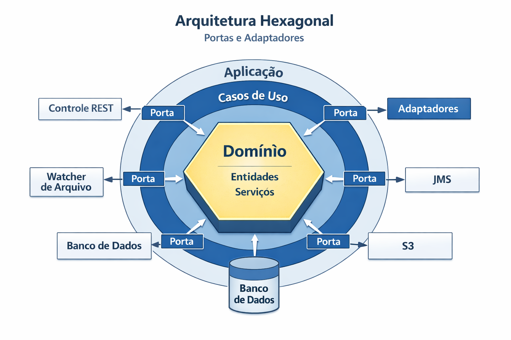
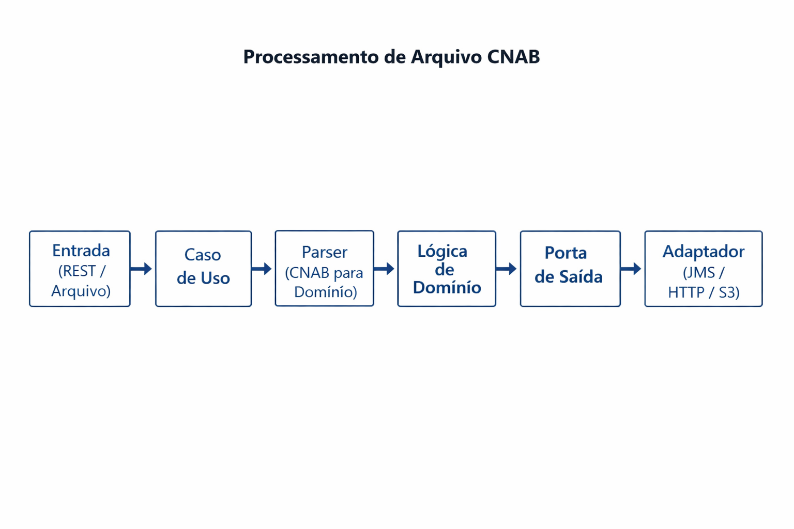

# CNAB Transformer (Spring + Kotlin)

Este projeto propõe uma estrutura robusta para o processamento de arquivos **CNAB 240**, utilizando os princípios da **Arquitetura Hexagonal (Ports & Adapters)**. O objetivo principal é garantir que o núcleo de negócio seja isolado de detalhes técnicos e de infraestrutura.

## Arquitetura do Projeto

A arquitetura hexagonal permite que a aplicação seja testável e independente de frameworks, bancos de dados ou interfaces externas.

### Camadas Principais

| Camada | Responsabilidade |
| :--- | :--- |
| **Domain** | Núcleo puro contendo entidades, value objects e serviços de domínio. Sem dependências de frameworks. |
| **Application** | Orquestração de casos de uso, DTOs e lógica de aplicação. |
| **Ports** | Definições de contratos (interfaces) que preservam o isolamento do núcleo. |
| **Adapters** | Implementações concretas (inbound/outbound) que conversam com o mundo externo. |

## Fluxo de Processamento

O processamento de um arquivo CNAB segue um fluxo linear e bem definido através das camadas:

1.  **Entrada**: O arquivo é recebido via REST ou detectado por um watcher de diretório.
2.  **Caso de Uso**: A aplicação orquestra o início do processamento.
3.  **Parser**: Transforma o conteúdo posicional do CNAB em modelos de domínio.
4.  **Lógica de Domínio**: Aplica as regras de negócio necessárias.
5.  **Saída**: O resultado é enviado através de uma porta de saída para um adaptador (JMS, HTTP ou Storage).

## Estrutura de Pacotes

A organização dos pacotes em `src/main/kotlin/com/reicorp/cnab/transformer` reflete essa arquitetura:

-   `domain.entities`: Entidades e objetos de valor.
-   `domain.services`: Serviços com regras de negócio complexas.
-   `application`: Casos de uso e orquestração.
-   `domain.ports.in`: Interfaces chamadas por adaptadores de entrada.
-   `domain.ports.out`: Interfaces implementadas por adaptadores de saída.
-   `infrastructure`: Implementações concretas (REST, JMS, Repositórios, Mappers).

## Motivação

-   **Isolamento**: Separar regras de negócio de detalhes de infraestrutura.
-   **Flexibilidade**: Permitir múltiplos adaptadores sem alterar o núcleo.
-   **Testabilidade**: Facilitar a criação de testes unitários e de integração.

## Como Contribuir

1.  Implemente os contratos em `domain.ports.*`.
2.  Desenvolva os casos de uso em `application`.
3.  Crie a lógica de parsing para mapear o CNAB 240.
4.  Implemente os adaptadores necessários na camada de `infrastructure`.
