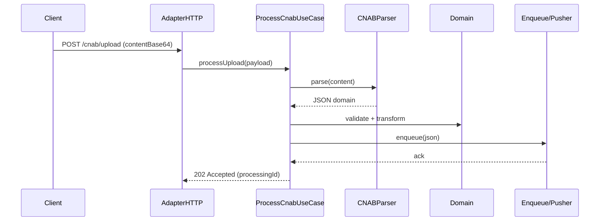
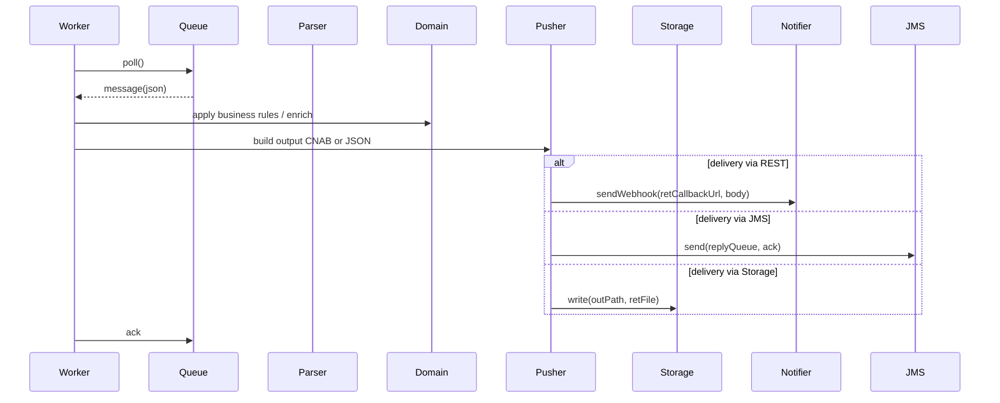

# Fluxos detalhados

Este documento descreve os principais fluxos do componente: Ingestão (HTTP-BASE64 / Direct-File / S3 / FileWatch), Parsing (CNAB -> JSON), Enfileiramento, Consumo (workers) e Geração/Entrega de retorno `.RET` (Webhook / Storage / JMS).

1) Ingestão — alto nível

Notas
- Para FileWatch/SFTP/S3, o Adapter substitui o Controller e chama o mesmo `ProcessCnabUseCase` com metadata de origem.

2) Worker — consumo e entrega

3) Geração de `.RET` e ACK
- O Worker, ao finalizar o processamento, pode gerar `.RET` (arquivo posicional) via o builder `JSON -> CNAB` usando `BankProfile` e:
  - gravar o arquivo em `RETORNO/` (S3/FS) ou
  - enviar o conteúdo codificado em Base64 via webhook ou
  - publicar mensagem de ACK na `replyQueue` JMS.

4) Erros, retries e DLQ
- Validations fatais no parse -> responder 400/REJECTED ao cliente (no caminho sync) e registrar ocorrência.
- Falhas durante delivery -> aplicar retry exponencial; após N tentativas mover mensagens para DLQ e emitir alert.

Considerações de observabilidade
- Tracing: propagar `processingId`, `X-Event-Id` e requestId em logs e headers.
- Metrics: queue depth, processing latency, error rates, delivery success ratio.

