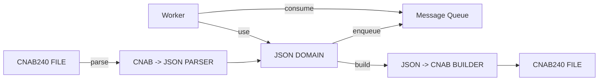

# JSON CNAB — ÍNDICE

Objetivo: guia rápido e legível para desenvolvedores que convertem entre CNAB240 e um JSON minimalista focado em pagamentos.

Navegação rápida (clique para abrir)

- [STRUCTURE.md](STRUCTURE.md) — Estrutura JSON mínima, regras visuais e tabela de campos essenciais (1 lote = 1 tipo)
- [PARSER-CNAB-JSON.md](PARSER-CNAB-JSON.md) — Como construir o parser CNAB240 -> JSON (leitura posicional -> domínio)
- [PARSER-JSON-CNAB.md](PARSER-JSON-CNAB.md) — Como construir o builder JSON -> CNAB240 (JSON -> posicional)
- [SEGMENT-Z.md](SEGMENT-Z.md) — Extensão do JSON para o Segmento Z (resposta) e parser para a linha do Segmento Z
- [EXAMPLE-CNAB.JSON](EXAMPLE-CNAB.JSON) — Exemplo prático (1 lote por tipo) — arquivo de testes
- [JSON-SCHEMA.md](JSON-SCHEMA.md) — Documentação completa e referências (PDFs e mapeamentos)

Resumo do fluxo

- Entrada (CNAB): arquivos posicional 240 bytes
- Parser (CNAB -> JSON): extrai campos essenciais para o domínio (ver [PARSER-CNAB-JSON.md](PARSER-CNAB-JSON.md))
- JSON (domínio): formato minimalista usado internamente e para filas
- Output (JSON -> CNAB): builder que preenche posições usando `BankProfile` e campos fixos (ver [PARSER-JSON-CNAB.md](PARSER-JSON-CNAB.md))

Leitura recomendada

1. [STRUCTURE.md](STRUCTURE.md) — entenda os campos mínimos e regras (1 lote = 1 paymentType)
2. [PARSER-CNAB-JSON.md](PARSER-CNAB-JSON.md) — implemente o parser de leitura
3. [PARSER-JSON-CNAB.md](PARSER-JSON-CNAB.md) — implemente o builder de escrita
4. [SEGMENT-Z.md](SEGMENT-Z.md) — se você precisa gerar/ler segmento Z (resposta), leia esta página adicional

Diagrama geral

Suporte e referências

- Consulte `documentations/payments/cnab/` para layouts e exemplos por banco (Santander)
- Consulte `documentations/payments/santander-openworld/` para APIs de saída e regras BaaS/Open Finance
