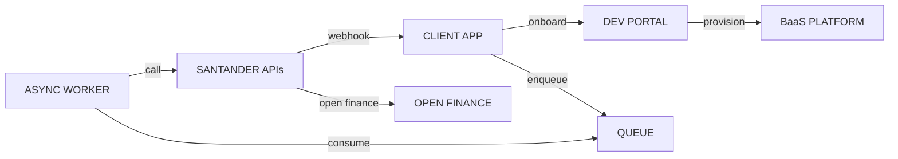

# BAAS / PORTAL / OPEN — RESUMO

- BaaS: serviços bancários expostos via APIs (conta, pagamentos, cobrança, conciliação).
- Developer Portal: documentação, sandbox, onboarding, credenciais, certificação.
- Open Finance: ecossistema de compartilhamento de dados e iniciação de pagamentos com consentimento.

Mermaid — visão resumida

Pontos chave

- Autenticação: OAuth2 (Client Credentials), mTLS e API keys em produção.
- Sandboxes: testar fluxos com webhooks simulados.
- Assincronismo: enfileirar pedidos, workers, reconciliadores e webhooks para status finais.

