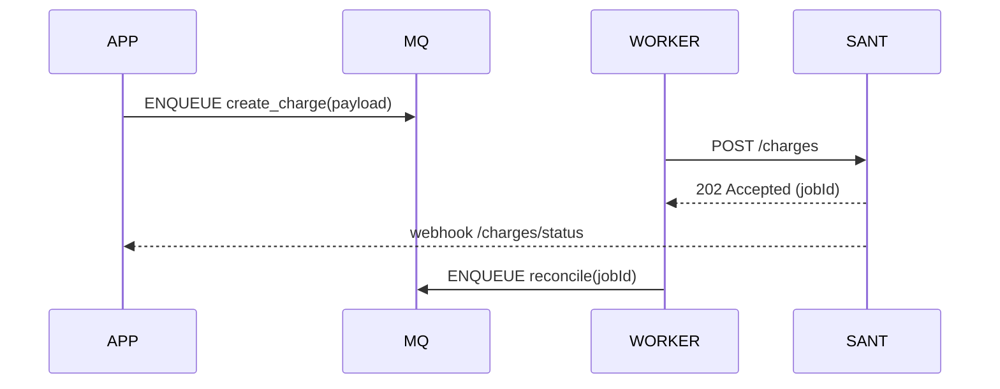

# CORBAN DIGITAL — OVERVIEW

Arquivos nesta pasta:
- `OVERVIEW.md` (você está aqui)
- `INTEGRATION-ASYNC.md` — integração assíncrona (queue/REST)
- `ENDPOINTS-SUMMARY.md` — resumo de endpoints
- `EXAMPLES.md` — exemplos de payloads

Resumo:
- Cobrança digital, registro/baixa de boletos, retornos e conciliação.
- Uso típico: enfileirar pedido de registro de cobrança; worker processa e chama API Santander; reconciliador trata retornos.

Diagrama (alto nível)

