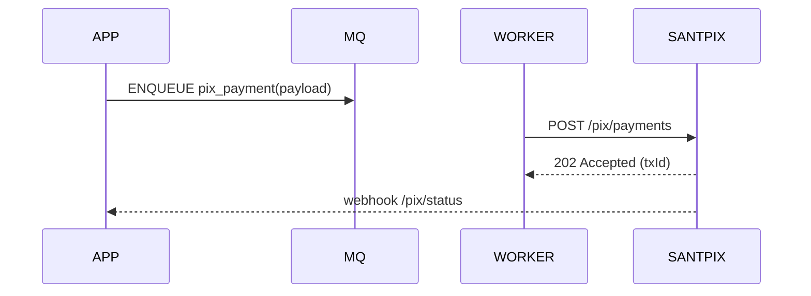

# PIX TRANSFERS — OVERVIEW

Arquivos nesta pasta:
- `OVERVIEW.md`
- `INTEGRATION-ASYNC.md`
- `ENDPOINTS-SUMMARY.md`
- `EXAMPLES.md`

Resumo:
- API para iniciar pagamentos Pix, checar status, e receber notificações (webhooks).
- Suportar tipos: Cob (cobrança), Pix instantâneo, Pix Agendado, devoluções.

Diagrama

