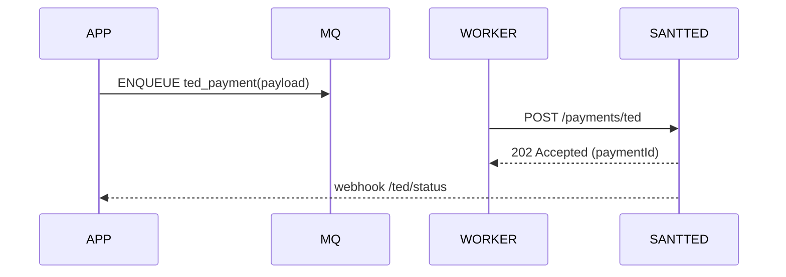

# TED TRANSFERS — OVERVIEW

Arquivos: `OVERVIEW.md`, `INTEGRATION-ASYNC.md`, `ENDPOINTS-SUMMARY.md`, `EXAMPLES.md`

Resumo:
- API para iniciar TED, consultar status e reconciliar.
- Fluxo assíncrono recomendado para processamento em lote ou por demanda.

Diagrama

