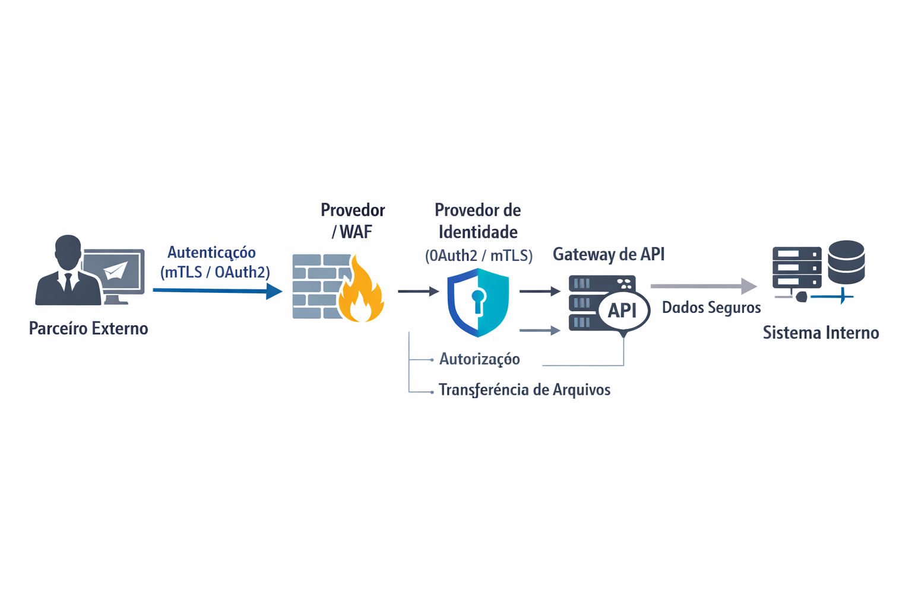

# Segurança na Troca de Arquivos CNAB

Este documento estabelece as diretrizes e recomendações de segurança para a integração com sistemas externos que realizam a troca de arquivos CNAB. O objetivo é garantir a **confidencialidade**, **integridade** e **disponibilidade** dos dados.

## Visão Geral da Segurança

A segurança na troca de arquivos é baseada em camadas, utilizando protocolos de transporte seguros e mecanismos robustos de autenticação e autorização.

### Princípios Gerais

-   **Transporte Seguro**: TLS 1.2+ é obrigatório para todos os endpoints HTTP (preferencialmente TLS 1.3).
-   **Autenticação Forte**: Uso de mTLS (Mutual TLS) ou OAuth2 Client Credentials.
-   **Isolamento de Dados**: Segregação de ambientes e políticas por `clientUuid`.
-   **Transferência de Arquivos**: Preferência por autenticação baseada em chaves (SFTP) ou URLs pré-assinadas (S3/GCS).

## Métodos de Integração Segura

Oferecemos diferentes canais de integração, cada um com seus requisitos específicos de segurança.

### 1. SFTP (Secure File Transfer Protocol)
-   **Autenticação**: Baseada exclusivamente em chaves SSH. O uso de senhas é proibido.
-   **Isolamento**: Implementação de `chroot` por usuário e diretórios segregados por `clientUuid`.
-   **Integridade**: Geração de checksums (SHA-256) após o upload.

### 2. Cloud Storage (S3 / GCS)
-   **Uploads Temporários**: Uso de *Pre-signed URLs* com TTL curto.
-   **Acesso Direto**: Políticas de IAM restritas por prefixo (`incoming/<clientUuid>/`).
-   **Criptografia**: Habilitação obrigatória de *Server-Side Encryption* (SSE).

### 3. API REST (HTTP-BASE64)
-   **Autenticação**: OAuth2 ou mTLS.
-   **Idempotência**: Uso obrigatório de `Idempotency-Key` no header.
-   **Proteção contra DoS**: Limitação de taxa (Rate Limiting) e validação do tamanho do payload antes da decodificação.

## Recomendações por Cenário

| Perfil do Parceiro | Recomendação de Segurança |
| :--- | :--- |
| **Pequenos Parceiros** | OAuth2 Client Credentials + TLS + HMAC para Webhooks. |
| **Integrações Críticas** | mTLS + VPN (opcional) + OAuth2. |
| **Transferência em Lote** | SFTP com chaves SSH + Checksum SHA-256. |

## Monitoramento e Auditoria

-   **Logs Detalhados**: Registro de quem, quando, qual arquivo e IP de origem.
-   **Alertas**: Notificações para falhas repetidas de upload ou atividades suspeitas.
-   **Retenção**: Manutenção de logs de auditoria conforme requisitos regulatórios.
