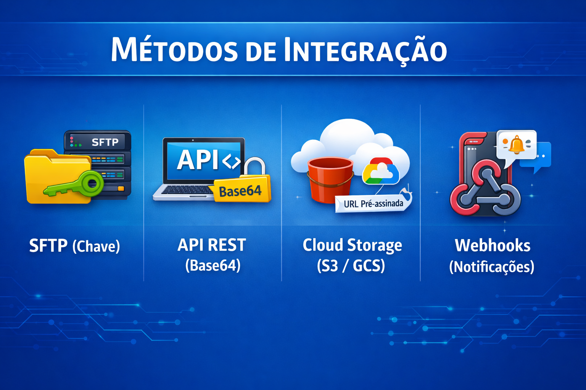

# HTTP-BASE64 — Visão Geral da Integração

Este documento descreve o método de recebimento de arquivos CNAB via requisição **HTTP POST**, onde o conteúdo do arquivo é codificado em **Base64** no corpo de um JSON.

## Descrição do Método

Este canal é ideal para clientes que possuem capacidade de realizar chamadas a APIs REST e preferem o transporte seguro via HTTPS.

### Vantagens e Desafios

| Vantagem | Desafio |
| :--- | :--- |
| **Simplicidade**: Integração direta via REST. | **Tamanho do Payload**: A codificação Base64 aumenta o tamanho em ~33%. |
| **Controle Imediato**: Resposta síncrona ou assíncrona. | **Timeouts**: Uploads muito grandes podem causar problemas de conexão. |
| **Compatibilidade**: Funciona com firewalls e infraestrutura HTTP padrão. | **Consumo de Memória**: Exige decodificação no servidor. |

## Estrutura da Documentação

Para uma implementação completa, consulte os seguintes documentos nesta pasta:

-   `API-SPEC.md`: Especificação técnica detalhada (endpoints, headers, payload).
-   `EXAMPLES.md`: Exemplos práticos de requisições e respostas.
-   `SECURITY.md`: Recomendações de segurança (TLS, Autenticação, Rate Limit).

## Fluxo de Operação

1.  **Codificação**: O cliente lê o arquivo CNAB e o converte para uma string Base64.
2.  **Envio**: Realiza um POST para o endpoint `/v1/cnab/upload` com o JSON contendo o Base64.
3.  **Validação**: O servidor valida o token de acesso e a integridade do payload.
4.  **Processamento**: O arquivo é decodificado e enviado para o pipeline de validação CNAB.
5.  **Resposta**: O servidor retorna um `202 Accepted` com o ID do processamento.

## Requisitos de Segurança

-   **Autenticação**: OAuth2 Client Credentials ou mTLS.
-   **Idempotência**: Uso obrigatório do header `Idempotency-Key`.
-   **Criptografia**: TLS 1.2 ou superior é obrigatório.
