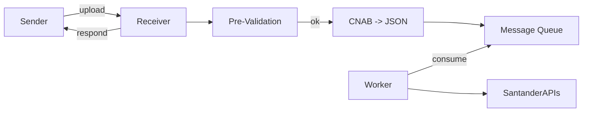

# RECEBIMENTO CNAB — ÍNDICE

Esta seção descreve como receber arquivos CNAB (entrada) e retornar respostas / relatórios de validação. Existem 3 modos documentados, cada um com propostas técnicas, exemplos e recomendações de segurança:

- [HTTP-BASE64](HTTP-BASE64/OVERVIEW.md) — envio via chamada HTTP com payload em Base64
- [DIRECT-FILE](DIRECT-FILE/OVERVIEW.md) — transferência direta de arquivos (SFTP/SMB/Cloud)
- [FILEWATCH-SCHED](FILEWATCH-SCHED/OVERVIEW.md) — leitura por filewatch ou scheduler com push de notificação

- Segurança consolidada: [Segurança — CNAB e trocas](../../segurança/INDEX.md)

Arquivos relevantes (links rápidos)
- HTTP-BASE64: [API-SPEC](HTTP-BASE64/API-SPEC.md), [EXAMPLES](HTTP-BASE64/EXAMPLES.md)
- DIRECT-FILE: [SFTP](DIRECT-FILE/SFTP.md), [S3-GCS](DIRECT-FILE/S3-GCS.md), [SMB](DIRECT-FILE/SMB.md)
- FILEWATCH-SCHED: [FILEWATCH](FILEWATCH-SCHED/FILEWATCH.md), [PUSH-NOTIFY](FILEWATCH-SCHED/PUSH-NOTIFY.md), [SCHEDULER](FILEWATCH-SCHED/SCHEDULER.md)

Regras comuns a todos os modos
- Cada envio deve incluir um `clientUuid` (UUID v4) no envelope/metadados.
- O pipeline faz validações pré-parser conforme `documentations/payments/validações/VALIDACOES-CNAB.md`.
- Resposta padrão: JSON com `status` (ACCEPTED/REJECTED/ERROR), `processingId` (UUID), e `validationReport` (quando aplicável).

Fluxo resumido

Leia a documentação na ordem: HTTP-BASE64 -> DIRECT-FILE -> FILEWATCH-SCHED.

