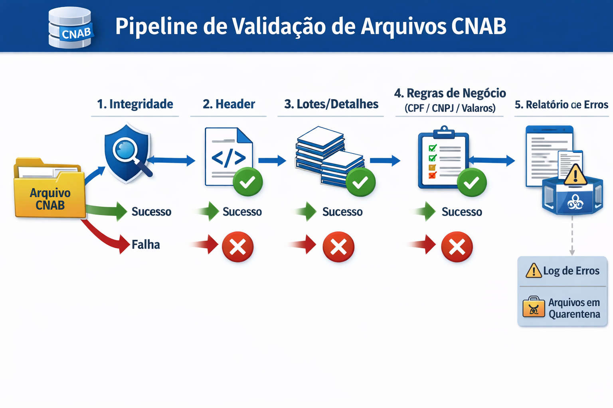

# Guia Completo de Validações CNAB (Pré-Parser)

Este documento detalha todas as validações que devem ser aplicadas ao arquivo CNAB antes do processamento pelo parser. O objetivo é garantir a integridade dos dados e a conformidade com as regras de negócio e operacionais.

## Pipeline de Validação

O processo de validação é dividido em etapas sequenciais, desde a integridade física do arquivo até as regras de negócio específicas por tipo de pagamento.

## 1. Níveis de Severidade

Cada falha de validação é classificada por um nível de severidade que determina a ação a ser tomada pelo sistema.

| Símbolo | Nível | Ação Recomendada |
| :--- | :--- | :--- |
| 🔴 | **FATAL** | Aborta o processamento; move o arquivo para quarentena/DLQ; notifica a equipe. |
| 🟠 | **WARNING** | Registra o erro; segrega os registros afetados; processa o restante com atenção. |
| 🟢 | **INFO** | Realiza ajuste automático (normalização); registra a informação no log. |

## 2. Validações de Arquivo (Estrutura e Integridade)

| Regra | Descrição | Severidade |
| :--- | :--- | :--- |
| **Tamanho do Arquivo** | O tamanho total deve ser múltiplo de 240 bytes (`fileSize % 240 == 0`). | 🔴 |
| **Arquivo Vazio** | O arquivo não deve estar vazio. | 🔴 |
| **Comprimento da Linha** | Cada registro (linha) deve ter exatamente 240 bytes. | 🔴 |
| **Encoding** | Padrão ISO-8859-1 (Latin-1). Falha na conversão para UTF-8 é crítica. | 🔴 |

## 3. Validações de Cabeçalho e Rodapé (Header/Trailer)

### 3.1 File Header (Registro 0)
- **Tipo de Registro**: Deve ser '0'. (🔴)
- **Código do Banco**: Validar se corresponde ao banco esperado (ex: 033 para Santander). (🔴)
- **Data do Arquivo**: Formato YYYYMMDD; deve ser uma data plausível. (🟠/🔴)

### 3.2 Batch Header (Registro 1) e Trailer (Registro 5)
- **Consistência de Lote**: Cada lote deve conter apenas um tipo de pagamento. (🔴)
- **Contagem de Detalhes**: O número de registros no lote deve coincidir com o informado no trailer. (🔴)
- **Somatórios**: O valor total do lote deve coincidir com a soma dos valores individuais. (🟠)

## 4. Validações por Tipo de Pagamento

### A. PIX
- **Chave PIX**: Validar formato conforme o tipo (E-mail, Telefone, CPF, CNPJ ou EVP/UUID).
- **Idempotência**: Verificar se o `txid` já foi processado com sucesso. (🔴)
- **Limites**: Validar contra limites diários e por transação. (🟠)

### B. Boleto / Código de Barras
- **Código de Barras**: Deve conter exatamente 44 dígitos numéricos. (🔴)
- **Checksum**: Validar dígito verificador (módulo 10 ou 11). (🔴)
- **Data de Vencimento**: Deve ser uma data válida e plausível. (🔴)

### C. TED / Transferências
- **Dados Bancários**: Validar código do banco, agência e conta (incluindo dígito verificador). (🔴)
- **Documento do Favorecido**: Validar algoritmo de CPF ou CNPJ. (🔴)

## 5. Regras Operacionais e Integração

Para integração com as APIs do Santander, os seguintes requisitos devem ser observados:

- **Idempotência**: Uso obrigatório de `X-Request-Id` (UUID) para evitar duplicidade.
- **Headers Obrigatórios**: `Authorization` (Bearer Token), `Content-Type` (application/json).
- **Tratamento de Erros**: Seguir o catálogo de códigos de erro padronizado para respostas rápidas.

---

*Nota: Este guia deve ser revisado periodicamente conforme atualizações nos layouts dos bancos e novas regulamentações do Banco Central.*
