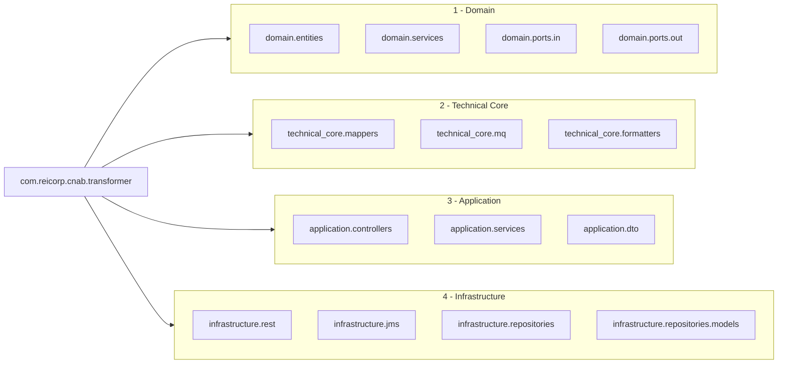

com.reicorp.cnab.transformer package structure

Basic 4-layer structure

```mermaid
graph TD
  Root[com.reicorp.cnab.transformer]
  Root --> Domain[1. domain]
  Root --> Tech[2. technical_core (4)]
  Root --> App[3. application (3)]
  Root --> Infra[4. infrastructure (4)]
```

All packages (expanded)



1) Domain
- Purpose: central business `entities` and domain `services`. Entities represent business concepts and are the core of the architecture. Domain services implement business logic that operates on entities.
- Packages:
  - `com.reicorp.cnab.transformer.domain.entities` — domain entities
  - `com.reicorp.cnab.transformer.domain.services` — domain services
  - `com.reicorp.cnab.transformer.domain.ports.in` — inbound contracts defined by the core
  - `com.reicorp.cnab.transformer.domain.ports.out` — outbound contracts defined by the core

2) Technical Core
- Purpose: technical components that support domain operations. They may depend on domain types but must not reference infrastructure-specific code.
- Packages:
  - `com.reicorp.cnab.transformer.core.mappers` — mapping logic (CNAB <-> JSON), bank-specific strategies/versioning
  - `com.reicorp.cnab.transformer.core.mq` — MQ helpers (enqueue/dequeue patterns)
  - `com.reicorp.cnab.transformer.core.formatters` — formatting utilities (dates, numbers, codecs)

3) Application
- Purpose: application-level orchestration and DTOs for the boundary of the system. This layer coordinates domain and technical core to implement use cases.
- Packages:
  - `com.reicorp.cnab.transformer.application.controllers` — request handlers / controllers
  - `com.reicorp.cnab.transformer.application.services` — application services / orchestrators
  - `com.reicorp.cnab.transformer.application.dto` — DTOs used at the application boundary

4) Infrastructure
- Purpose: concrete adapters and infrastructure implementations that bind the application to external systems. Adapters implement the interfaces defined under `domain.ports.*`.
- Packages (under `infrastructure`):
  - `com.reicorp.cnab.transformer.infrastructure.rest` — REST controllers and REST clients
  - `com.reicorp.cnab.transformer.infrastructure.jms` — JMS listeners and producers
  - `com.reicorp.cnab.transformer.infrastructure.repositories` — repository implementations (DAOs)
  - `com.reicorp.cnab.transformer.infrastructure.repositories.models` — persistence models (DB/JPA entities)

Dependency rules
- `infrastructure.rest` / `infrastructure.jms` / `infrastructure.repositories` -> `application`
- `application` -> `technical_core` + `domain`
- `technical_core` -> `domain`
- `domain` MUST NOT depend on `application` or `infrastructure`

Notes
- Keep mapping/versioning for bank-specific formats inside `technical_core.mappers` as strategies.
- Convert between `domain.entities` and `repositories.models` inside repository adapters.


