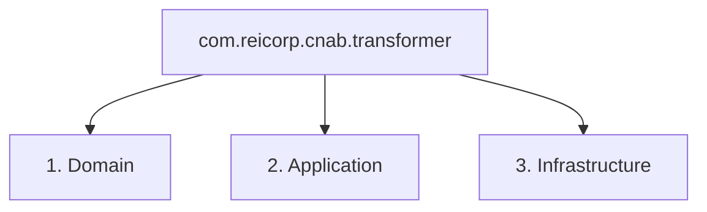
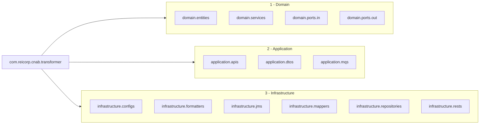
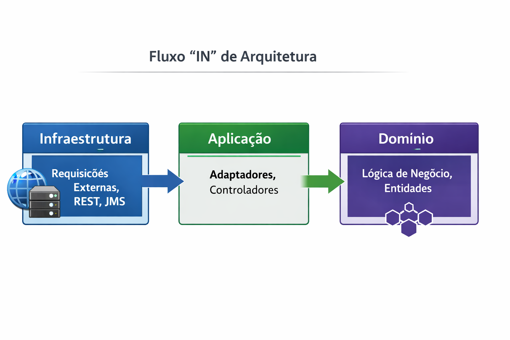
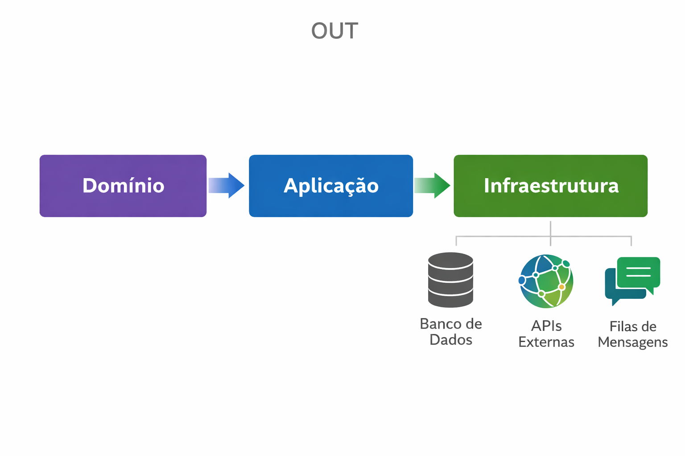

# Estrutura de Pacotes `com.reicorp.cnab.transformer`

Este documento descreve a estrutura de pacotes do projeto `cnab-transformer-spring-kotlin`, seguindo princípios de arquitetura limpa e focando na separação de responsabilidades para garantir manutenibilidade e escalabilidade. A organização dos pacotes é baseada em camadas que definem fluxos de dependência unidirecionais.

## Estrutura Básica de Camadas

A arquitetura do projeto é dividida em três camadas principais, que representam diferentes níveis de abstração e responsabilidade:



## Todos os Pacotes (Expandido)

A seguir, uma visão mais detalhada dos pacotes e seus submódulos:



## Descrição Detalhada dos Pacotes

### 1) Domain

-   **Propósito**: Contém a lógica de negócio central, as `entities` (entidades) e os `services` (serviços) de domínio. As entidades representam os conceitos de negócio e são o coração da arquitetura. Os serviços de domínio implementam a lógica de negócio que opera sobre as entidades.
-   **Pacotes**:
    -   `com.reicorp.cnab.transformer.domain.entities` — Entidades de domínio.
    -   `com.reicorp.cnab.transformer.domain.services` — Serviços de domínio que orquestram a lógica de negócio.
    -   `com.reicorp.cnab.transformer.domain.ports.in` — Contratos de entrada (interfaces) definidos pelo core do domínio, a serem implementados por camadas externas.
    -   `com.reicorp.cnab.transformer.domain.ports.out` — Contratos de saída (interfaces) definidos pelo core do domínio, a serem implementados por camadas externas.

### 2) Application

-   **Propósito**: Responsável pela orquestração em nível de aplicação e pelos DTOs (Data Transfer Objects) que definem o limite do sistema. Esta camada coordena o domínio e a infraestrutura para implementar os casos de uso.
-   **Pacotes**:
    -   `com.reicorp.cnab.transformer.application.apis` — Contém controladores REST e clientes de API.
    -   `com.reicorp.cnab.transformer.application.dtos` — DTOs utilizados na fronteira da aplicação para comunicação de dados.
    -   `com.reicorp.cnab.transformer.application.mqs` — Lida com consumidores e produtores de mensagens (Message Queues).

### 3) Infrastructure

-   **Propósito**: Contém as implementações concretas de adaptadores e a infraestrutura que conecta a aplicação a sistemas externos. Os adaptadores implementam as interfaces definidas em `domain.ports.*`.
-   **Pacotes**:
    -   `com.reicorp.cnab.transformer.infrastructure.configs` — Configurações específicas da infraestrutura.
    -   `com.reicorp.cnab.transformer.infrastructure.formatters` — Utilitários de formatação (datas, números, codecs).
    -   `com.reicorp.cnab.transformer.infrastructure.jms` — Implementações de listeners e produtores JMS.
    -   `com.reicorp.cnab.transformer.infrastructure.mappers` — Lógica de mapeamento (CNAB <-> JSON), estratégias/versionamento específicos de bancos.
    -   `com.reicorp.cnab.transformer.infrastructure.repositories` — Implementações de repositórios (DAOs) e seus modelos de persistência (`models`).
    -   `com.reicorp.cnab.transformer.infrastructure.rests` — Implementações de clientes e serviços REST.

## Regras de Dependência

As dependências entre as camadas devem seguir um fluxo unidirecional para manter a arquitetura limpa e desacoplada. As regras são as seguintes:

-   **Fluxo de Entrada (IN)**: `Infrastructure` -> `Application` -> `Domain`
    -   A camada de `Infrastructure` pode depender da camada de `Application`.
    -   A camada de `Application` pode depender da camada de `Domain`.
    -   A camada de `Domain` não deve depender de `Application` ou `Infrastructure`.

-   **Fluxo de Saída (OUT)**: `Domain` -> `Application` -> `Infrastructure`
    -   A camada de `Domain` define portas (interfaces) que são implementadas pela camada de `Application` ou `Infrastructure`.
    -   A camada de `Application` implementa portas de saída do `Domain` e pode depender da `Infrastructure` para detalhes de implementação.
    -   A camada de `Infrastructure` implementa as portas de saída definidas no `Domain`.

**Nunca se deve seguir os caminhos opostos a essas estruturas.**

## Workflows

### Workflow de Entrada (IN)

Este workflow ilustra como as requisições externas fluem através das camadas até a lógica de negócio central.

```mermaid
graph TD
    subgraph Infrastructure [Infraestrutura]
        I_Rest[Requisições Externas (REST)]
        I_JMS[Mensagens JMS]
    end

    subgraph Application [Aplicação]
        A_API[Controladores API]
        A_MQ[Consumidores MQ]
    end

    subgraph Domain [Domínio]
        D_PortIn[Portas de Entrada]
        D_Serv[Serviços de Domínio]
        D_Ent[Entidades]
    end

    I_Rest --> A_API
    I_JMS --> A_MQ
    A_API --> D_PortIn
    A_MQ --> D_PortIn
    D_PortIn --> D_Serv
    D_Serv --> D_Ent

    style Domain fill:#f9f,stroke:#333,stroke-width:4px
    style Application fill:#bbf,stroke:#333,stroke-width:2px
    style Infrastructure fill:#dfd,stroke:#333,stroke-width:2px
```



### Workflow de Saída (OUT)

Este workflow demonstra como a lógica de negócio no domínio interage com sistemas externos através das camadas de aplicação e infraestrutura.

```mermaid
graph TD
    subgraph Domain [Domínio]
        D_Serv[Serviços de Domínio]
        D_PortOut[Portas de Saída]
    end

    subgraph Application [Aplicação]
        A_Impl[Implementações de Portas]
    end

    subgraph Infrastructure [Infraestrutura]
        I_Repo[Repositórios (DB)]
        I_RestOut[Clientes REST Externos]
        I_JMSOut[Produtores JMS]
    end

    D_Serv --> D_PortOut
    D_PortOut --> A_Impl
    A_Impl --> I_Repo
    A_Impl --> I_RestOut
    A_Impl --> I_JMSOut

    style Domain fill:#f9f,stroke:#333,stroke-width:4px
    style Application fill:#bbf,stroke:#333,stroke-width:2px
    style Infrastructure fill:#dfd,stroke:#333,stroke-width:2px
```



## Notas

-   Mantenha a lógica de mapeamento e versionamento para formatos bancários específicos dentro de `infrastructure.mappers` como estratégias.
-   Converta entre `domain.entities` e `infrastructure.repositories.models` dentro dos adaptadores de repositório.
