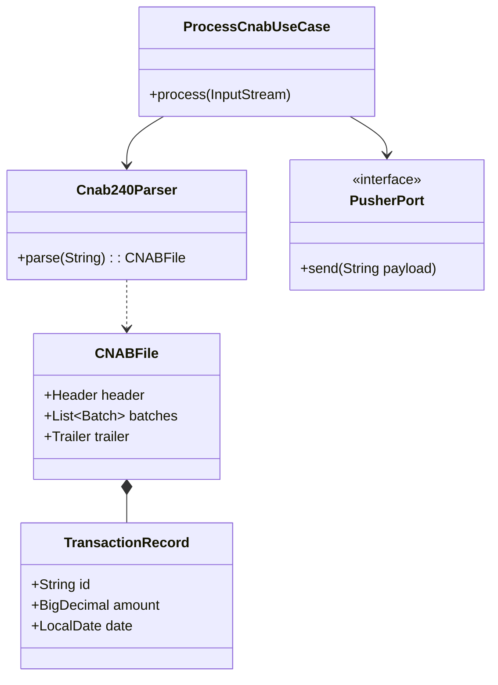

# Proposta de Classes e Responsabilidades

Este documento detalha as principais classes e interfaces propostas para o sistema de processamento de arquivos **CNAB 240**, seguindo os princípios da **Arquitetura Hexagonal**.

## Visão Geral das Classes

Abaixo, apresentamos a organização das classes por camada e suas respectivas responsabilidades.

## Detalhamento por Camada

### 1. Domain (Core)

O núcleo do sistema contém as definições fundamentais do negócio.

| Classe | Tipo | Responsabilidade |
| :--- | :--- | :--- |
| `TransactionRecord` | Data Class | Representa uma transação individual extraída do CNAB. |
| `CNABFile` | Data Class | Representa o arquivo CNAB consolidado (header, batches, trailers). |
| `ParserException` | Exception | Exceções específicas lançadas durante o parsing do arquivo. |
| `DomainService` | Interface | Serviços que implementam regras de negócio complexas. |

### 2. Ports (Interfaces)

Definem os contratos de entrada e saída da aplicação.

-   **Inbound Ports**:
    -   `IngestFilePort`: Aceita a entrada de arquivos (InputStream ou Path).
    -   `ProcessCnabPort`: Expõe o método para processar o CNAB e retornar o resultado.
-   **Outbound Ports**:
    -   `PusherPort`: Envia o JSON resultante para sistemas externos.
    -   `StoragePort`: Salva ou arquiva os arquivos recebidos.

### 3. Application

Orquestra os casos de uso do sistema.

-   `ProcessCnabUseCase`: Implementação principal que coordena o parsing, a transformação e o envio dos dados.
-   `CnabDto`: Objeto de transferência de dados consolidado para comunicação externa.
-   `UseCaseException`: Exceções de nível de aplicação.

### 4. Adapters (Infrastructure)

Implementações concretas que conectam o sistema ao mundo externo.

| Tipo | Adaptador | Descrição |
| :--- | :--- | :--- |
| **Inbound** | `RestController` | Endpoint Spring para upload de arquivos via HTTP. |
| **Inbound** | `FileWatcherJob` | Job que monitora diretórios e inicia o processamento. |
| **Outbound** | `HttpPusherAdapter` | Envia dados via RestTemplate ou WebClient. |
| **Outbound** | `JmsPusherAdapter` | Envia dados utilizando mensageria JMS. |
| **Outbound** | `S3StorageAdapter` | Armazena arquivos no AWS S3. |

### 5. Parser

Responsável pela tradução técnica do formato posicional.

-   `Cnab240Parser`: Classe que lê as linhas posicionais e as mapeia para objetos de domínio.
-   `Cnab240Mapping`: Utilitários que definem as posições e tamanhos de cada campo do CNAB.

## Observações Importantes

-   **Testabilidade**: Priorize interfaces e testes unitários para o domínio e casos de uso.
-   **Robustez**: O parser deve ser testado exaustivamente com diversos exemplos de arquivos CNAB.
-   **Desacoplamento**: O núcleo não deve conhecer detalhes de frameworks como Spring ou bibliotecas de persistência.
